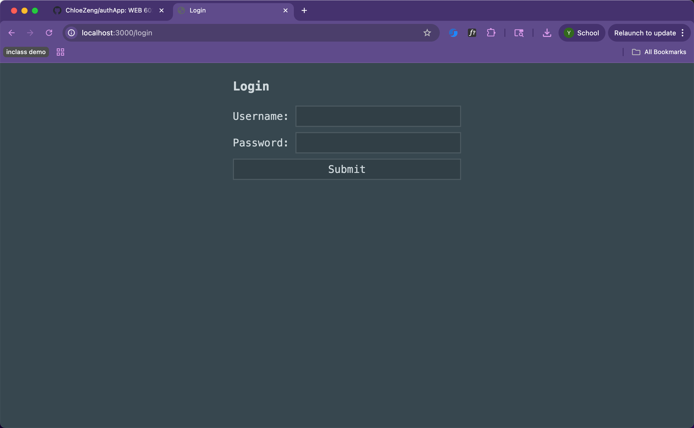
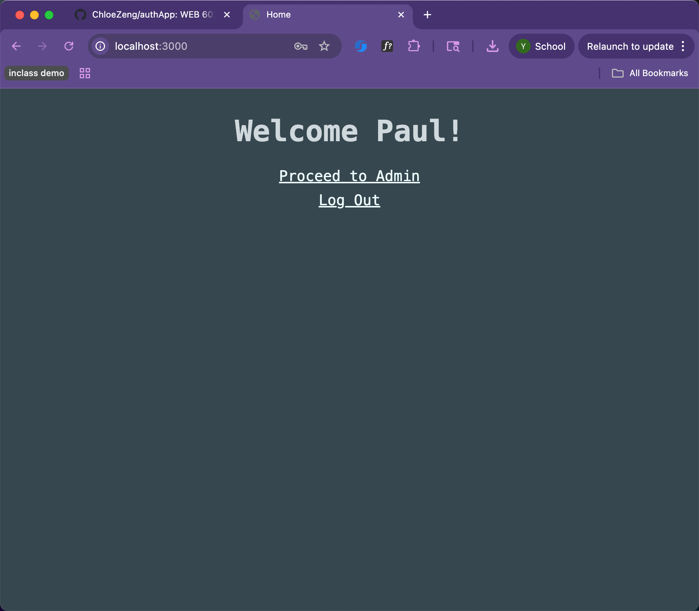
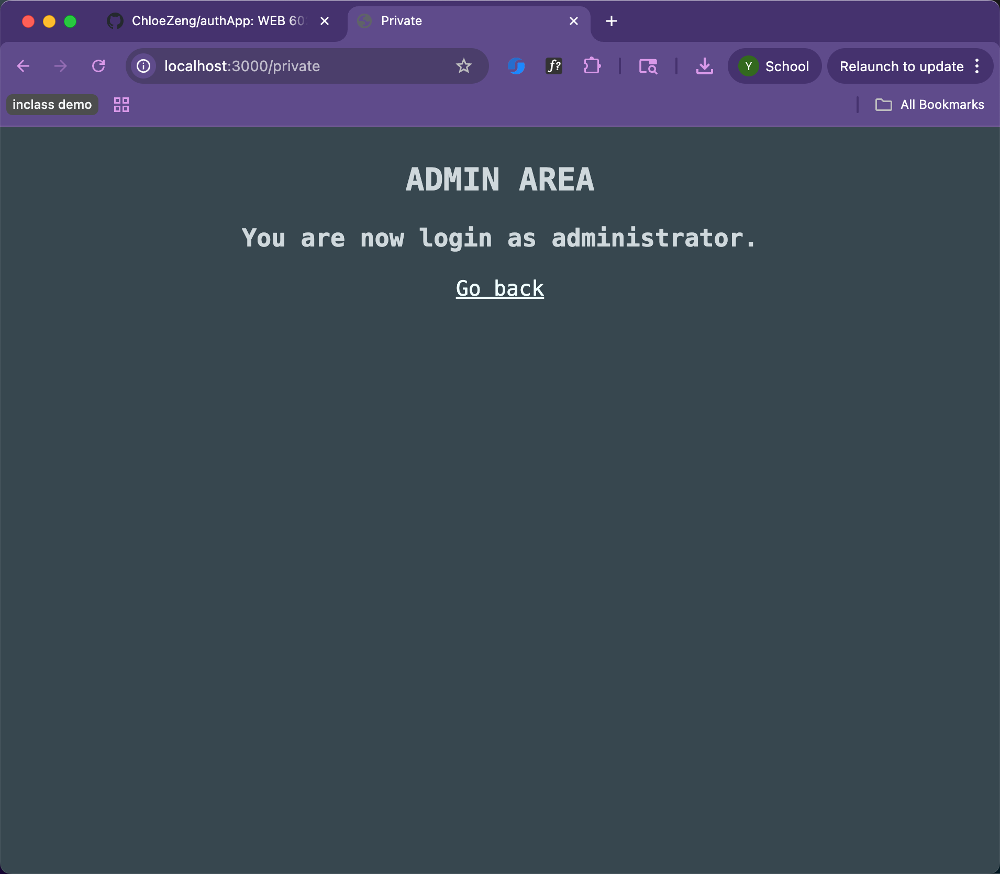
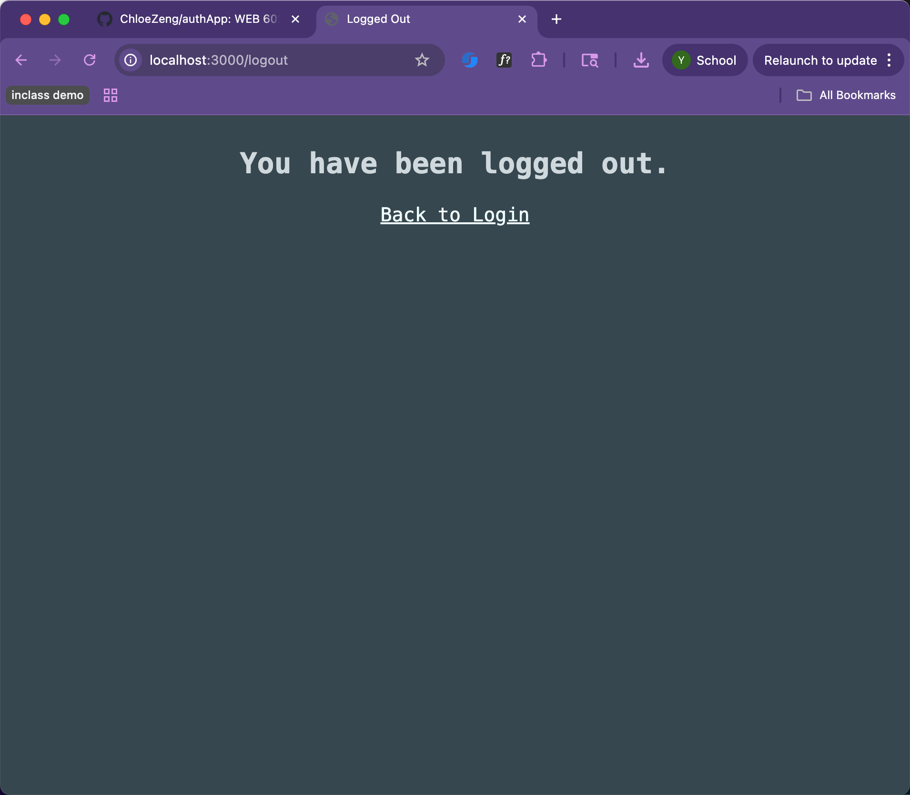

# authApp
WEB 602 Back-end authentication

week6 day 1 homework
I learnd password using passport in node.js. Also connect to mongo db use mydatabase

WEEK6 DAY 2 HOMEWORK
I learned how to set timer to users account, also how to check it in browser. I tested 3 users in Microsoft Edge.

